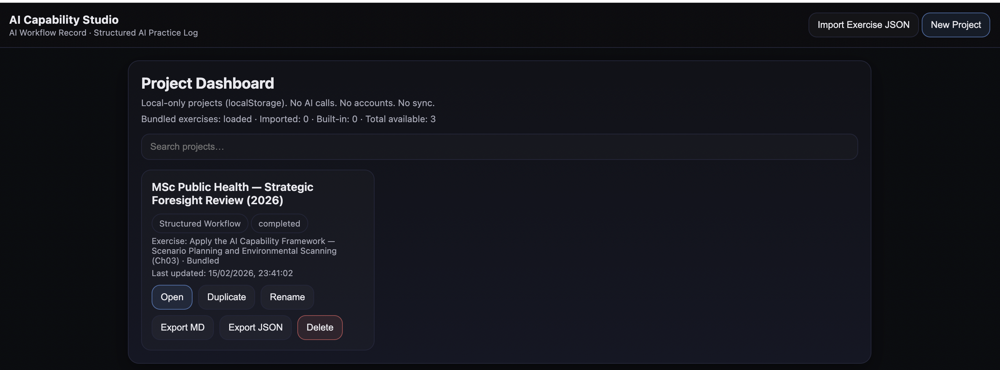

# CloudPedagogy AI Capability Studio

AI Capability Studio is a static, offline-first, browser-based tool for
**structured human--AI workflow documentation**.

It enables educators, researchers, strategy teams, and governance
leaders to:

-   Apply structured AI capability workflows\
-   Generate export-ready **AI Workflow Records**\
-   Document human judgement and AI involvement\
-   Support governance and audit trails\
-   Maintain local-only, privacy-preserving workflow logs

All exercises follow a **chapter-level `structured_workflow`
architecture (schema v1.0)**.

------------------------------------------------------------------------

## 🌐 Live Hosted Version

The Studio is publicly accessible at:

http://cloudpedagogy-ai-capability-studio.s3-website.eu-west-2.amazonaws.com/

The hosted version behaves identically to a locally run version.

**Important:**\
All projects created on the hosted site are stored **only in the user's
browser (localStorage)**.\
No project data is transmitted to, stored by, or accessible to
CloudPedagogy.

------------------------------------------------------------------------

## 🖼 Interface Overview

### Dashboard



### Creating a New Project


### Structured Workflow Step


### Exporting a Governance Record


------------------------------------------------------------------------

## 🎬 What This Repository Demonstrates

This repository is a **working prototype + reference implementation** of
AI Capability Studio.

It includes:

1.  **Bundled example exercises** (loaded from `/exercises/index.json`)\
2.  A sample exported workflow record in
    `/demo/msc_public_health_strategic_foresight_review_2026.md`

These are demonstration artefacts.

In normal institutional use:

-   Exercises are generated using the CloudPedagogy **Meta‑Prompt
    Pack**, then bundled into `/exercises/`, **or**
-   Imported manually via **Import Exercise JSON**

> The repository does not contain runnable "projects." Projects are
> created by users and stored locally in their own browser.

------------------------------------------------------------------------

## 🔍 How Studio Works

Studio separates **exercise templates**, **projects**, and **AI
outputs**.

### Exercises (Templates)

Exercises are JSON definition files that:

-   Follow the `structured_workflow` schema\
-   Contain exactly 6 structured steps (s1--s6)\
-   Define fields, instructions, reflection prompts, and copyable AI
    prompt blocks\
-   Load from `/exercises/index.json` or are imported manually

Exercises are reusable workflow blueprints.

------------------------------------------------------------------------

### Projects (User Work)

When a user clicks **New Project**, Studio:

-   Creates a project linked to one exercise\
-   Auto-saves continuously using browser `localStorage`\
-   Persists only on that device + browser + site URL (origin)

Key points:

-   No server storage\
-   No shared state\
-   Projects are origin-specific (localhost ≠ production URL)\
-   Clearing browser storage removes projects

⚠ **Users are strongly encouraged to export projects regularly**
(Markdown or JSON) as clearing browser data may permanently remove
stored projects.

------------------------------------------------------------------------

### AI Outputs

Studio does not call AI APIs.

Instead:

1.  Users complete structured fields\
2.  Click **Copy Prompt**\
3.  Paste into an external AI tool (ChatGPT, Claude, Gemini, etc.)\
4.  Critically review outputs\
5.  Record refined human judgement in Studio

AI outputs are advisory drafts. Human decision authority remains
explicit and documented.

------------------------------------------------------------------------

## 🏗 Architecture

AI Capability Studio is:

-   Pure HTML\
-   Vanilla JavaScript\
-   LocalStorage persistence\
-   JSON-driven exercise definitions\
-   `structured_workflow` schema v1.0 aligned

There is:

-   No backend\
-   No authentication\
-   No cloud sync\
-   No analytics\
-   No data transmission

Suitable for governance-sensitive institutional environments.

------------------------------------------------------------------------

## 🚀 Running the Studio

### Hosted (Recommended for End Users)

Use the live version:

http://cloudpedagogy-ai-capability-studio.s3-website.eu-west-2.amazonaws.com/

No installation required.

------------------------------------------------------------------------

### Local (For Technical Users)

From project root:

``` bash
python3 -m http.server 8000
```

Then open:

    http://localhost:8000

If opened via `file://`, bundled exercises may not load due to browser
security restrictions. Use **Import Exercise JSON** instead.

------------------------------------------------------------------------

## 📤 Exporting Records

Studio supports:

-   Markdown export (.md)\
-   JSON export (.json)

Exports include:

-   Project metadata\
-   Inputs\
-   Step responses\
-   Prompt snapshots\
-   Governance reflections\
-   AI use statement (if defined)

Export files serve as governance documentation and backup.

------------------------------------------------------------------------

## 🔒 Privacy & Data Responsibility

-   No data leaves the browser\
-   No tracking or telemetry\
-   No analytics\
-   No remote storage

CloudPedagogy does not collect, access, or store user project data.

Users are responsible for exporting and backing up their own workflow
records.

------------------------------------------------------------------------

## ⚖ Disclaimer & Positioning

AI Capability Studio is provided as an open-source, static workflow
support tool.

It is offered as a **supplementary implementation layer** to paid
CloudPedagogy courses and frameworks.

The software itself:

-   Is provided "as-is" without warranty\
-   Does not include technical support obligations\
-   Does not guarantee compatibility with all browsers or institutional
    environments\
-   Does not store or manage user data

Paid course content covers structured AI capability design and
governance practice --- not software support or infrastructure
management.

Institutional customisation or integration services may be available
separately by agreement.

------------------------------------------------------------------------

## 🔧 Extensibility

AI Capability Studio is open-source and may be adapted or extended to
suit institutional needs.

Typical extension areas include:

-   Adding new exercise templates\
-   Modifying UI components\
-   Hosting in institutional static environments

CloudPedagogy does not provide development support for custom forks or
institutional modifications unless separately agreed.

------------------------------------------------------------------------

## 📌 Versioning

App version: v0.1.2\
Schema: structured_workflow v1.0\
Exercise ID Convention: v1.1 (chapter-level)

Status:

-   Stable prototype\
-   Governance-oriented\
-   Chapter-level architecture locked\
-   Ready for institutional demonstration

------------------------------------------------------------------------

## 🌐 About CloudPedagogy

CloudPedagogy develops governance-ready AI capability frameworks,
structured curriculum tools, and practical workflow systems for higher
education and public sector strategy.

AI Capability Studio operationalises structured human--AI collaboration
in complex institutional environments.
